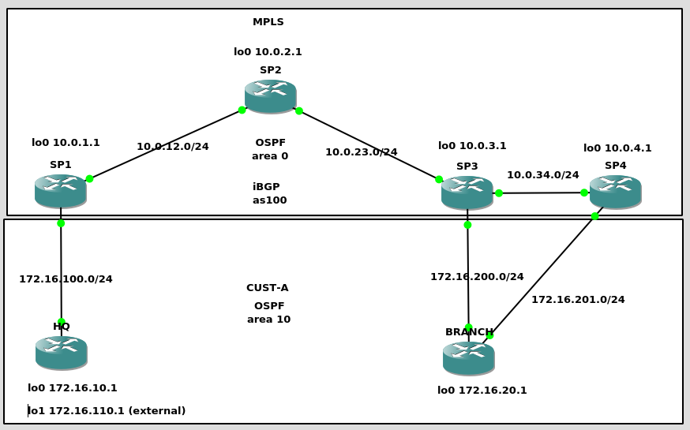

OSPF Down Bit is part of the RFC: https://tools.ietf.org/html/rfc4577

I am following this blog for the explanation of OSPF Down bit: http://dtdccie.blogspot.com/2016/03/ospf-down-bit-set.html

This lab is built on c7200-adventerprisek9-mz.124-24.T2

My laptop is running Debian 10 Testing, Intel i7 and 8GB RAM.

This is the network diagram

